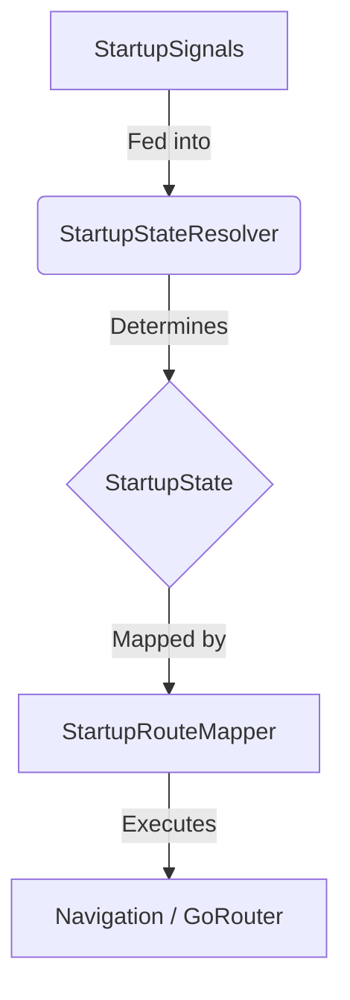

# 🚀 Flutter Riverpod Boilerplate (Opinionated)


A **production-ready Flutter boilerplate** for building **scalable, maintainable, real-world applications**.

This repository is intentionally **opinionated**, strictly structured, and optimized for **long-term growth**, not experimentation.

> **Clone → Build → Ship.** > No architecture debates. No rewrites at scale.

---

## ⭐ Why This Repo?

- Built for **production**, not demos
- Enforces **clean architecture** by default
- Uses **modern Flutter + Riverpod best practices**
- Eliminates architectural decision fatigue
- Designed for **teams and long-lived apps**

If you value **clarity over flexibility**, this boilerplate is for you.

---

## ✨ Tech Stack

- **Flutter (stable)**
- **Riverpod** – `AsyncNotifier` / `AsyncValue` only
- **GoRouter** with guarded routes
- **Explicit Startup State Machine**
- **Clean Architecture** (feature-first)
- **Strict linting**
- **CI-ready**

---

## 🎯 Philosophy

This boilerplate exists to:

1.  Enforce **one clear way** to build Flutter apps.
2.  Prevent architectural drift as the app grows.
3.  Scale cleanly from MVP → large production app.
4.  Catch mistakes early through structure and conventions.

Flexibility is intentionally limited.

---

## ❌ What This Is NOT

- ❌ A tutorial
- ❌ A pattern comparison repo
- ❌ A flexible playground

If you disagree with these decisions, **fork the repo**.

---

## 🧱 Core Architectural Rules (Non-Negotiable)

- ✅ `AsyncNotifier` only (`@riverpod`)
- ❌ No `StateNotifier` or `ChangeNotifier`
- ✅ Repositories return `Result<T>`
- ✅ UI consumes `AsyncValue<T>`
- ✅ Startup flow is handled by a **state machine**
- ✅ `GoRouter` enforces access, not startup logic
- ❌ No `Dio` usage outside the data layer
- ❌ No business logic inside widgets

These rules are enforced by **structure**, not documentation alone.

---

## 📁 Folder Structure

This boilerplate follows a **feature-first, clean architecture** approach.  
Every feature uses the **same internal structure**.

```text
lib/
├── app/
│   ├── app.dart
│   ├── bootstrap.dart
│   ├── app_config.dart
│   └── startup/
│       ├── startup_state_machine.dart   # Logic
│       ├── startup_signals.dart         # Inputs
│       ├── startup_state_resolver.dart  # Processor
│       └── startup_route_mapper.dart    # Output
│
├── core/
│   ├── errors/
│   ├── network/
│   ├── result/
│   ├── storage/
│   └── widgets/
│
├── features/
│   └── auth/                            # Example feature
│       ├── data/
│       ├── domain/
│       └── presentation/
│
└── main.dart
```

> **Note:** All features must follow the same internal structure as `auth`.

---

## 🖼️ Splash Screen Strategy

This boilerplate uses `flutter_native_splash` for the native launch experience.

The Flutter `SplashPage` is **not** a visual splash. It exists only to:
1.  Collect startup signals
2.  Resolve the startup state
3.  Navigate to the correct route

All visuals are handled natively to ensure:
* Faster startup
* No blank frames
* No unnecessary Flutter UI work

---

## 🧠 Startup Architecture (State Machine)

Startup behavior is modeled as an **explicit state machine**, not router logic.

### 1. Startup Signals (Inputs)
Runtime facts collected at launch:
* Authentication status
* Onboarding completion
* Maintenance flag
* Feature availability

### 2. Startup States (Decisions)
Valid startup states include: `MaintenanceState`, `OnboardingState`, `UnauthenticatedState`, `AuthenticatedState`, `PublicState`.

### 3. Resolution Flow



This guarantees:
* ✅ No invalid flows
* ✅ No redirect loops
* ✅ Fully testable startup logic
* ✅ Clean separation of concerns

---

## ✅ Supported App Scenarios

This boilerplate supports all common real-world flows. No architectural changes are required — only signal values change.

| Scenario | Supported |
| :--- | :---: |
| Onboarding + Login required | ✅ |
| Onboarding without login | ✅ |
| Onboarding with optional login | ✅ |
| Public home with protected features | ✅ |
| Login without onboarding | ✅ |
| No-auth apps | ✅ |
| Maintenance mode | ✅ |
| Feature-flagged startup | ✅ |

---

## 🔐 Routing Responsibility

* **SplashPage:** Decides where the app starts.
* **Startup State Machine:** Decides what state the app is in.
* **GoRouter:** Only enforces route access.

Authentication is enforced **per-route**, not globally. This avoids startup logic in router redirects, onboarding/auth coupling, and fragile redirect chains.

---

## ➕ Adding a New Feature

1.  Create `features/your_feature/`
2.  Follow the same `data` → `domain` → `presentation` structure
3.  Export routes from `presentation/routes`
4.  Register routes in the router

> If your feature doesn’t fit this structure, rethink the feature.

---

## 🛠️ Scripts

Helpful scripts included:

```bash
./scripts/bootstrap.sh   # Initial setup
./scripts/clean.sh       # Clean project
```

---

## 🚀 Getting Started

**Prerequisites:** Flutter SDK installed (or FVM).

1.  **Clone:**
    ```bash
    git clone [https://github.com/your-username/your-repo.git](https://github.com/your-username/your-repo.git)
    ```

2.  **Setup:**
    ```bash
    flutter pub get
    flutter pub run build_runner build --delete-conflicting-outputs
    ```

3.  **Run:**
    ```bash
    flutter run
    ```

---

## 📜 License

MIT — use it, fork it, ship it.

---

**This boilerplate is for developers who value correctness, clarity, and long-term maintainability over choice.** If that’s you — welcome aboard 🚀
