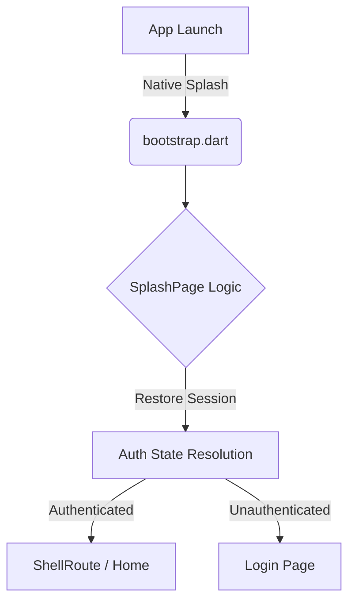

# 🚀 Flutter Riverpod Boilerplate (Opinionated)


A **production-ready Flutter boilerplate** for building **scalable, maintainable, real-world apps**.

This repository is intentionally **opinionated**, strictly structured, and optimized for **long-term growth**, not experimentation.

> **Clone → Build → Ship.** > No architecture debates. No rewrites at scale.

---

## ⭐ Why This Repo?

- Built for **production**, not demos.
- Enforces **clean architecture** by default.
- Uses **modern Flutter + Riverpod best practices**.
- Eliminates architectural decision fatigue.
- Ideal for **teams and long-lived apps**.

If you value **clarity over flexibility**, this is for you.

---

## ✨ Tech Stack

- **Flutter (stable)**
- **Riverpod** – `AsyncNotifier` only
- **GoRouter** with `ShellRoute`
- **Clean Architecture** (feature-first)
- **Strict linting**
- **CI-ready**

---

## 🎯 Philosophy

This boilerplate exists to:

1.  Enforce **one clear way** to build Flutter apps.
2.  Prevent architectural drift as the app grows.
3.  Scale cleanly from MVP → large production app.
4.  Catch mistakes early through structure and conventions.

Flexibility is intentionally limited.

---

## ❌ What This Is NOT

- ❌ A tutorial
- ❌ A pattern comparison repo
- ❌ A flexible playground

If you disagree with these decisions, **fork the repo**.

---

## 🧱 Core Architectural Rules (Non-Negotiable)

- ✅ `AsyncNotifier` only (`@riverpod`)
- ❌ No `StateNotifier` or `ChangeNotifier`
- ✅ Repositories must return `Result<T>`
- ✅ UI must consume `AsyncValue<T>`
- ✅ `GoRouter` + `ShellRoute` is mandatory
- ✅ Feature isolation is enforced
- ❌ No `Dio` usage outside the data layer

These rules are enforced by **structure**, not documentation alone.

---

## 📁 Folder Structure

This boilerplate follows a **feature-first, clean architecture** approach.  
Every feature uses the **same internal structure**.

```text
lib/
├── app/
│   ├── app.dart                 # Root widget
│   ├── bootstrap.dart           # App initialization
│   └── router/
│       ├── app_router.dart      # GoRouter configuration
│       ├── auth_routes.dart     # Public/auth routes
│       └── protected_routes.dart
│
├── core/                        # Shared logic (Theme, Network, Storage)
│   ├── errors/
│   ├── network/
│   ├── result/
│   ├── storage/
│   └── widgets/
│
├── features/
│   └── auth/                    # Example feature
│       ├── data/
│       │   ├── datasources/
│       │   ├── models/
│       │   └── repositories/
│       │
│       ├── domain/
│       │   ├── entities/
│       │   ├── repositories/
│       │   └── usecases/
│       │
│       ├── presentation/
│       │   ├── pages/
│       │   ├── providers/
│       │   └── routes/
│       │
│       └── auth_feature.dart    # Feature barrel file
│
└── main.dart
```

---

## 🖼️ Splash Screen Strategy

This boilerplate uses `flutter_native_splash` for the launch experience.

The Flutter `SplashPage` is **not** a visual splash. It exists only for:
1.  **App initialization**
2.  **Session restoration**
3.  **Early dependency setup**
4.  **Redirecting** to the correct route

All visual splash rendering is handled natively, ensuring:
* Faster startup
* No blank frames
* No unnecessary Flutter UI work

---

## 🔄 Startup Lifecycle

### High-Level Flow



### Detailed Steps

1.  **Native Splash:** Displayed immediately by the OS. No Flutter frame rendered yet.
2.  **bootstrap.dart:** Initializes DI, Logging, Storage, and Environment configs.
3.  **SplashPage:** Runs init logic (session restore) without rendering UI.
4.  **Auth Resolution:** Provider checks storage to determine `authenticated` vs `unauthenticated`.
5.  **Router Redirect:** `GoRouter` reacts to state and sends user to `ShellRoute` (Protected) or `Login`.

This flow ensures **no race conditions** and a clean separation of concerns.

---

## ➕ Adding a New Feature

1.  **Create folder:** `features/your_feature/`
2.  **Mirror structure:** (data → domain → presentation)
3.  **Export routes:** via `presentation/routes/`
4.  **Register:** Add to `protected_routes.dart`

> If your feature doesn’t fit this structure, rethink the feature.

---

## 🛠️ Scripts

Helpful scripts for development:

```bash
./scripts/bootstrap.sh   # Initial setup
./scripts/clean.sh       # Deep clean project (fvm flutter clean)
```

---

## 🚀 Getting Started

1.  **Prerequisites:** Flutter SDK installed (or FVM).
2.  **Clone:** `git clone https://github.com/your-username/repo-name.git`
3.  **Setup:**
    ```bash
    flutter pub get
    flutter pub run build_runner build --delete-conflicting-outputs
    ```
4.  **Run:** `flutter run`

---

## 📜 License

MIT — use it, fork it, ship it.

---

**This boilerplate is for developers who value clarity over choice.** If that’s you — welcome aboard.
